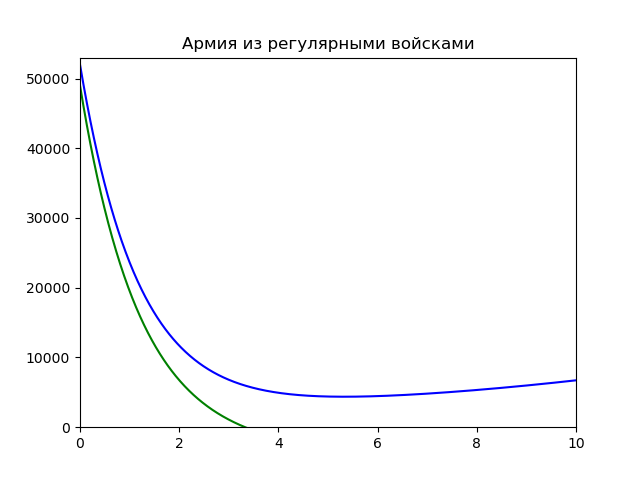
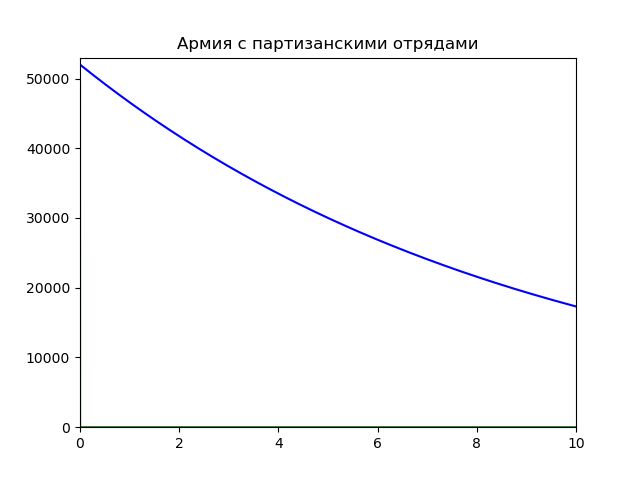

---
## Front matter
lang: ru-RU
title: "Лабораторная работа №3. Модель боевых действий."
author:  Евдокимов Максим Михайлович НФИбд-01-20\inst{1}
institute: \inst{1}Российский Университет Дружбы Народов

date: 23 февраля, 2023, Москва, Россия

## Formatting
mainfont: PT Serif
romanfont: PT Serif
sansfont: PT Sans
monofont: PT Mono
toc: false
slide_level: 2
theme: metropolis
header-includes: 
 - \metroset{progressbar=frametitle,sectionpage=progressbar,numbering=fraction}
 - '\makeatletter'
 - '\beamer@ignorenonframefalse'
 - '\makeatother'
aspectratio: 43
section-titles: true

---

# Цели и задачи работы

## Цель лабораторной работы

Нам необходимо рассмотреть модели простейших боевых действий, так называемые модели Ланчестера.
В моделях мы будем рассматривать три случая битв, сражение регулярных войск, сражение регулярных и партизанских войск, сражение партизанских войск.
Если численность армии обращается в нуль, то данная сторона считается проигравшей (при условии, что численность другой стороны в данный момент положительна).

## Задание к лабораторной работе

1. Выявить три случая модели Ланчестера, разобрать их теоретическое выведение.
2. Вывести уравнения для постоения моделей Ланчестера для двух случаев (Системы линейных неоднородных дифференциальных уравнений первого порядка с постоянными коэффициентами).
3. Построить графики изменения численности войск, используя текст лабораторной работы.
4. Определить победившую сторону.

# Процесс выполнения лабораторной работы

## Теоретический материал

Будем рассматривать три случая ведения боевых действий с учетом различных типов войск:

1. Боевые действия между регулярными войсками
2. Боевые действия с участием регулярных войск и партизанских отрядов
3. Боевые действия между партизанскими отрядами

# Первый случай

В первом случае модель боевых действий между регулярными войсками описывается следующим образом:

$$
 \begin{cases}
 \frac{dx}{dt}= -a(t)x(t) - b(t)y(t) + P(t)
 \\
 \frac{dy}{dt}= -c(t)x(t) - h(t)y(t) + Q(t)
 \end{cases}
$$

# Второй случай

Во втором уже расматривается модель боевых действий между регулярными и партизанскими войсками описывается как:

$$
 \begin{cases}
 \frac{dx}{dt}= -a(t)x(t) - b(t)y(t) + P(t)
 \\
 \frac{dy}{dt}= -c(t)x(t)y(t) - h(t)y(t) + Q(t)
 \end{cases}
$$

# Модель базовых боевых действий

В простейшей модели борьбы двух противников коэффициенты $b(t)$ и $c(t)$ являются постоянными. Состояние системы описывается точкой $(x,y)$ положительного квадранта плоскости. Координаты этой точки, $x$ и $y$ - это численности противостоящих армий. Тогда модель принимает вид

$$
 \begin{cases}
 \frac{dx}{dt}= -by
 \\
 \frac{dy}{dt}= -ax
 \end{cases}
$$

## Это - жесткая модель, которая допускает точное решение

$\frac{dx}{dy}=\frac{by}{cx}$

$cxdx=bydy, cx^2 - by^2 = C$

Эволюция численностей армий x и y происходит вдоль гиперболы, заданной уравнениями в тексте лабораторной работы. По какой именно гиперболе пойдет война, зависит от начальной точки.

## Вывод из модели

Для борьбы с вдвое более многочисленным противником нужно в четыре раза более мощное оружие, с втрое более многочисленным - в девять раз и т. д. (на это указывают квадратные корни в уравнении прямой).
Стоит помнить, что эта модель сильно идеализирована и неприменима к реальной ситуации. Но может использоваться для начального анализа.

# Задача

## Условие

Между страной Х и страной У идет война. Численность состава войск
исчисляется от начала войны, и являются временными функциями $x(t)$ и $y(t)$. В начальный момент времени страна Х имеет армию численностью 52 000 человек, а в распоряжении страны У армия численностью в 49 000 человек. Для упрощения модели считаем, что коэффициенты $a, b, c, h$ постоянны. Также считаем $P(t) и Q(t)$ непрерывные функции.
Постройте графики изменения численности войск армии Х и армии У для следующих случаев:

# Модель боевых действий между регулярными войсками

$$
 \begin{cases}
 \frac{dx}{dt}= -0.36x(t) - 0.48y(t) + sin(t + 1) + 1
 \\
 \frac{dy}{dt}= -0.6x(t) - 0.15y(t) + cos(t + 2) + 1.1
 \end{cases}
$$

{#fig:001 width=70% height=70%}

Победа достается армии $X$.

## Случай 2

# Модель ведение боевых действий с участием регулярных войск и партизанских отрядов

$$
 \begin{cases}
 \frac{dx}{dt}= -0.11x(t) - 0.68y(t) + sin(5t) + 1.1
 \\
 \frac{dy}{dt}= -0.91x(t)y(t) - 0.32y(t) + cos(5t) + 1
 \end{cases}
$$

{#fig:001 width=70% height=70%}

Победа достается армии $X$.

## Вывод

Из расмотренных моделей простейших боевых действий, основанных на модели Ланчестера. В моделях мы рассмотрели два случая битв:

1. Сражение регулярных войск.
2. Сражение регулярных и партизанских войск.

Проверили как работают модели в этих случаях, построили графики и сделали вывод о том, кто станет победителем в данных случаях.

# Источники информации

1. <https://ru.wikipedia.org/wiki/Законы_Осипова_—_Ланчестера>
2. <https://www.socionauki.ru/journal/articles/130365/>
3. <http://www.mathprofi.ru/sistemy_differencialnyh_uravnenij.html>
4. <https://nextjournal.com/sosiris-de/ode-diffeq>
5. <https://openmodelica.org/doc/OpenModelicaUsersGuide/latest/solving.html>
6. <https://habr.com/ru/post/209112/>
