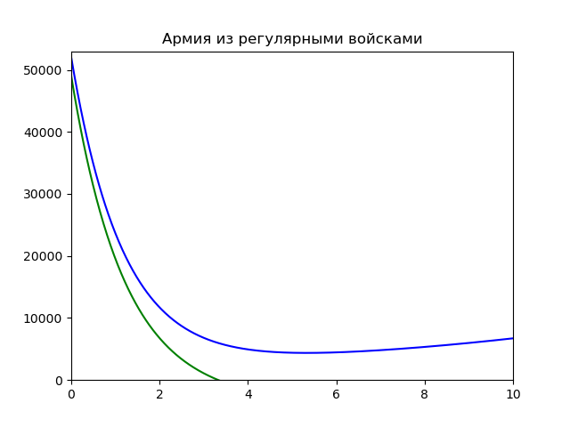
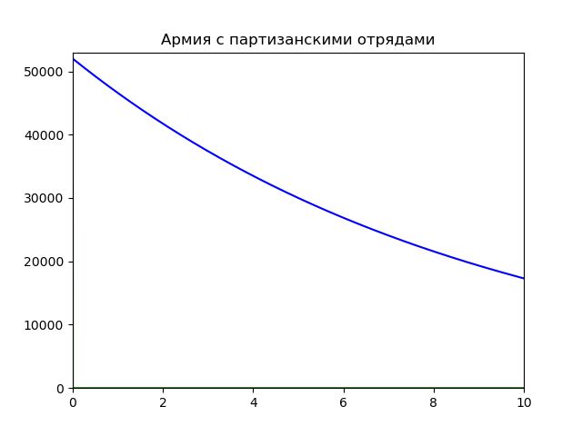
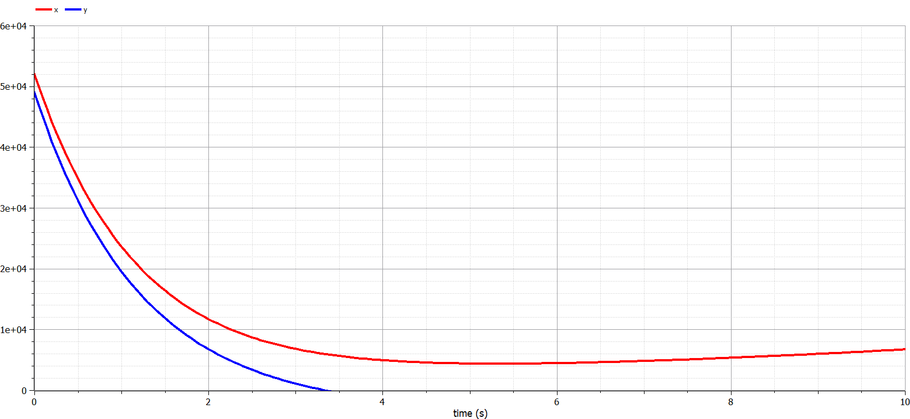
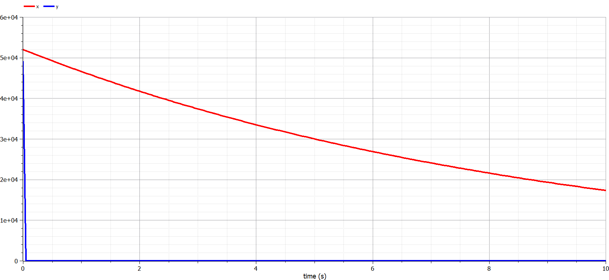

---
# Front matter
lang: ru-RU
title: "Лабораторная работа №3. Модель боевых действий."
subtitle: "Вариант №30"
author: "Евдокимов Максим Михайлович НФИбд-01-20"

# Formatting
toc-title: "Содержание"
toc: true # Table of contents
toc_depth: 2
lof: true # List of figures
fontsize: 12pt
linestretch: 1.5
papersize: a4paper
documentclass: scrreprt
polyglossia-lang: russian
polyglossia-otherlangs: english
mainfont: PT Serif
romanfont: PT Serif
sansfont: PT Sans
monofont: PT Mono
mainfontoptions: Ligatures=TeX
romanfontoptions: Ligatures=TeX
sansfontoptions: Ligatures=TeX,Scale=MatchLowercase
monofontoptions: Scale=MatchLowercase
indent: true
pdf-engine: lualatex
header-includes:
  - \linepenalty=10 # the penalty added to the badness of each line within a paragraph (no associated penalty node) Increasing the υalue makes tex try to haυe fewer lines in the paragraph.
  - \interlinepenalty=0 # υalue of the penalty (node) added after each line of a paragraph.
  - \hyphenpenalty=50 # the penalty for line breaking at an automatically inserted hyphen
  - \exhyphenpenalty=50 # the penalty for line breaking at an explicit hyphen
  - \binoppenalty=700 # the penalty for breaking a line at a binary operator
  - \relpenalty=500 # the penalty for breaking a line at a relation
  - \clubpenalty=150 # extra penalty for breaking after first line of a paragraph
  - \widowpenalty=150 # extra penalty for breaking before last line of a paragraph
  - \displaywidowpenalty=50 # extra penalty for breaking before last line before a display math
  - \brokenpenalty=100 # extra penalty for page breaking after a hyphenated line
  - \predisplaypenalty=10000 # penalty for breaking before a display
  - \postdisplaypenalty=0 # penalty for breaking after a display
  - \floatingpenalty = 20000 # penalty for splitting an insertion (can only be split footnote in standard LaTeX)
  - \raggedbottom # or \flushbottom
  - \usepackage{float} # keep figures where there are in the text
  - \floatplacement{figure}{H} # keep figures where there are in the text
---

# Цель работы

Нам необходимо рассмотреть модели простейших боевых действий, так называемые модели Ланчестера.
В моделях мы будем рассматривать три случая битв, сражение регулярных войск, сражение регулярных и партизанских войск, сражение партизанских войск.
Если численность армии обращается в нуль, то данная сторона считается проигравшей (при условии, что численность другой стороны в данный момент положительна).

# Задание

1. Выявить три случая модели Ланчестера, разобрать их теоретическое выведение.
2. Вывести уравнения для постоения моделей Ланчестера для двух случаев (Системы линейных неоднородных дифференциальных уравнений первого порядка с постоянными коэффициентами).
3. Построить графики изменения численности войск, используя текст лабораторной работы.
4. Определить победившую сторону.

# Выполнение лабораторной работы

## Теоретические сведения

Рассмотри два случая ведения боевых действий с учетом различных типов войск:

1. Боевые действия между регулярными войсками
2. Боевые действия с участием регулярных войск и партизанских отрядов

В первом случае ( сражение между регулярными войсками) численность войск определяется тремя факторами:

1. скорость уменьшения численности войск из-за причин, не связанных с боевыми действиями (болезни, травмы, дезертирство);
2. скорость потерь, обусловленных боевыми действиями противоборствующих сторон (что связанно с качеством стратегии, уровнем вооружения, профессионализмом солдат и т.п.);
3. скорость поступления подкрепления (задаётся некоторой функцией от времени).

## Модель боевых действий между регулярными войсками

$$
 \begin{cases}
 \frac{dx}{dt}= -a(t)x(t) - b(t)y(t) + P(t)
 \\
 \frac{dy}{dt}= -c(t)x(t) - h(t)y(t) + Q(t)
 \end{cases}
$$

## Теоретические сведения

Потери, которые не связанны с боевыми действиями, описывают так $–a(t)x(t)$ и $–h(t)y(t)$, а элементы $–b(t)y(t)$ и $–c(t)x(t)$ отражают потери на поле боя.
Коэффициенты $b(t)$, $c(t)$ указывают на эффективность боевых действий со стороны $y$ и $x$ соответственно, $a(t)$,$h(t)$  - величины, характеризующие степень влияния различных факторов на потери.
Функции $P(t)$,$Q(t)$  учитывают возможность подхода подкрепления к войскам $X$ и $Y$ в течение одного дня.

## Модель боевых действий между регулярными войсками и партизанскими отрядами

$$
 \begin{cases}
 \frac{dx}{dt}= -a(t)x(t) - b(t)y(t) + P(t)
 \\
 \frac{dy}{dt}= -c(t)x(t)y(t) - h(t)y(t) + Q(t)
 \end{cases}
$$

# Получаем 2 формулы

## Первый случай

Война между регулярными войсками. Модель принимает вид:

$$
 \begin{cases}
 \frac{dx}{dt}= -a(t)x(t) - b(t)y(t) + P(t)
 \\
 \frac{dy}{dt}= -c(t)x(t) - h(t)y(t) + Q(t)
 \end{cases}
$$

## Второй случай

Война между регулярными войсками и партизанскими отрядами. Модель принимает вид:

$$
 \begin{cases}
 \frac{dx}{dt}= -a(t)x(t) - b(t)y(t) + P(t)
 \\
 \frac{dy}{dt}= -cx(t)y(t) - h(t)y(t) + Q(t)
 \end{cases}
$$

# Задача

## Условие

Между страной Х и страной У идет война. Численность состава войск
исчисляется от начала войны, и являются временными функциями $x(t)$ и $y(t)$. В начальный момент времени страна Х имеет армию численностью 52 000 человек, а в распоряжении страны У армия численностью в 49 000 человек. Для упрощения модели считаем, что коэффициенты $a, b, c, h$ постоянны. Также считаем $P(t) и Q(t)$ непрерывные функции.
Постройте графики изменения численности войск армии Х и армии У для следующих случаев:

## Случай 1

### Модель боевых действий между регулярными войсками

$$
 \begin{cases}
 \frac{dx}{dt}= -0.36x(t) - 0.48y(t) + sin(t + 1) + 1
 \\
 \frac{dy}{dt}= -0.6x(t) - 0.15y(t) + cos(t + 2) + 1.1
 \end{cases}
$$

{#fig:001 width=70% height=70%}

.png){#fig:001 width=70% height=70%}

Победа достается армии $X$.

## Случай 2

### Модель ведение боевых действий с участием регулярных войск и партизанских отрядов

$$
 \begin{cases}
 \frac{dx}{dt}= -0.11x(t) - 0.68y(t) + sin(5t) + 1.1
 \\
 \frac{dy}{dt}= -0.91x(t)y(t) - 0.32y(t) + cos(5t) + 1
 \end{cases}
$$

{#fig:001 width=70% height=70%}

.png){#fig:001 width=70% height=70%}

Победа достается армии $X$.

# Код программы на Julia

```
using PyPlot
using DifferentialEquations

function f1(du, u, p, t)
    du[1] = -0.36*u[1] -0.48*u[2] + sin(t + 1) + 1
    du[2] = -0.49*u[1] -0.37*u[2] + cos(t + 2) + 1.1
end

function f2(du, u, p, t)
    du[1] = -0.11*u[1] -0.68*u[2] + sin(5t) + 1.1
    du[2] = -0.6*u[1]*u[2] -0.15*u[2] + cos(5t) + 1
end

function draw(p)
    ax = PyPlot.axes()
    ax.set_xlim(0, 53000)
    ax.set_ylim(0, 50000)
    ax.set_title(p)
    ax.plot(x, y, linestyle="-", color="red")
    show()
    close()
    ax = PyPlot.axes()
    ax.set_xlim(0, 10)
    ax.set_ylim(0, 53000)
    ax.set_title(p)
    ax.plot(time, x, linestyle="-", color="blue")
    ax.plot(time, y, linestyle="-", color="green")
    show()
    close()
end

const X = 52000
const Y = 49000
range = (0, 10)
ode = ODEProblem(f1, [X,Y], range)
sol = solve(ode, dtmax=0.01)
x = [u[1] for u in sol.u]
y = [u[2] for u in sol.u]
time = [t for t in sol.t]
draw("Армия из регулярными войсками")

ode = ODEProblem(f2, [X,Y], range)
sol = solve(ode, dtmax=0.01)
x = [u[1] for u in sol.u]
y = [u[2] for u in sol.u]
time = [t for t in sol.t]
draw("Армия с партизанскими отрядами")
```

# Код программы на OpenModelica

## случай 1

```
model model_1
  parameter Real a( start=0.36);
  parameter Real b( start=0.48);
  parameter Real c( start=0.49);
  parameter Real h( start=0.37);
  Real x(start=52000);
  Real y(start=49000);
  
  equation
    der(x)=-a*x-b*y+sin(time+1)+1;
    der(y)=-c*x-h*y+cos(time+2)+1.1;
  
  annotation(experiment(StartTime=0, StopTime=10, Tolerance=1e-6, Interval=0.05));  

end model_1;
```

### Получившиеся графики

{#fig:001 width=70% height=70%}

.png){#fig:001 width=70% height=70%}

## случай 2

```
model model_2
  parameter Real a( start=0.11);
  parameter Real b( start=0.68);
  parameter Real c( start=0.6);
  parameter Real h( start=0.15);
  Real x(start=52000);
  Real y(start=49000);
  
  equation
    der(x)=-a*x-b*y+sin(5*time)+1.1;
    der(y)=-c*x*y-h*y+cos(5*time)+1;
  
  annotation(experiment(StartTime=0, StopTime=10, Tolerance=1e-6, Interval=0.05));  

end model_2;
```

### Получившиеся графики

{#fig:001 width=70% height=70%}

.png){#fig:001 width=70% height=70%}

# Выводы

Рассмотрели модели простейших боевых действий, так называемые модели Ланчестера. Фактически научились програмировать более сложные дифференциальные уровнения такие как "Системы линейных неоднородных дифференциальных уравнений первого порядка с постоянными коэффициентами".
В разбмраемой задаче мы рассмотрели два случая битв:

1. Сражение регулярных войск.
2. Сражение регулярных и партизанских войск.

И проверили как работают модели в этих случаях, построили графики двух видов линейный и параметрический, и сделали вывод о том, кто станет победителем в данных случаях.

# Источники информации

1. <https://ru.wikipedia.org/wiki/Законы_Осипова_—_Ланчестера>
2. <https://www.socionauki.ru/journal/articles/130365/>
3. <http://www.mathprofi.ru/sistemy_differencialnyh_uravnenij.html>
4. <https://nextjournal.com/sosiris-de/ode-diffeq>
5. <https://openmodelica.org/doc/OpenModelicaUsersGuide/latest/solving.html>
6. <https://habr.com/ru/post/209112/>
