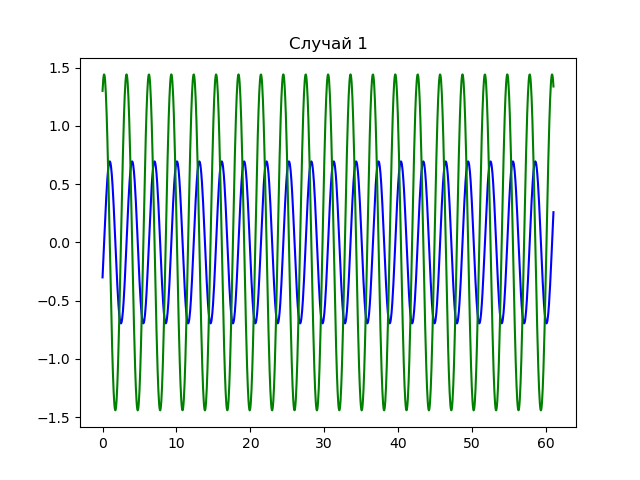

---
## Front matter
lang: ru-RU
title: Лабораторная работа №4 - "Модель гармонических колебаний"
author: |
	 Евдокимов Максим Михайлович. НФИбд-01-20.\inst{1}

institute: |
	\inst{1}Российский Университет Дружбы Народов

date: 27 марта, 2023, Москва, Россия

## Formatting
mainfont: PT Serif
romanfont: PT Serif
sansfont: PT Sans
monofont: PT Mono
toc: false
slide_level: 2
theme: metropolis
header-includes: 
 - \metroset{progressbar=frametitle,sectionpage=progressbar,numbering=fraction}
 - '\makeatletter'
 - '\beamer@ignorenonframefalse'
 - '\makeatother'
aspectratio: 43
section-titles: true

---

# Условия лабораторной работы

## Цель лабораторной работы

Изучить уравнение гармонического осцилятора без затухания. Записать данное уравнение и построить фазовый портрет гармонических и свободных колебаний.

## Задание к лабораторной работе

1. Построить решение уравнения гармонического осциллятора без затухания
2. Записать уравнение свободных колебаний гармонического осциллятора с затуханием, построить его решение. После построить фазовый портрет гармонических колебаний с затуханием.
3. Записать уравнение колебаний гармонического осциллятора, если на систему действует внешняя сила, построить решение и фазовый портрет.

# Теоретический материал

## Объеснения задания

Движение грузика на пружинке, маятника, заряда в электрическом контуре.
Также эволюция во времени многих систем в физике, химии, биологии и других науках при определенных предположениях можно описать одним дифференциальным уравнением, которое в теории колебаний выступает в качестве основной модели.
Такая модель называется линейным гармоническим осциллятором.

Уравнение же свободных колебаний гармонического осциллятора имеет вид:

$$\ddot{x}+2\gamma\dot{x}+\omega^2=0$$

## При отсутствие потерь

При отсутствии потерь в системе ( $\gamma=0$ ) мы получим уравнение консервативного осциллятора энергии колебания, которое сохранится во времени.

$$\ddot{x}+\omega^2x=0$$

## 

Для однозначной разрешимости уравнения второго порядка необходимо задать два начальных условия вида:

$$
 \begin{cases}
 x(t_0)=x_0
 \\
 \dot{x}(t_0)=y_0
 \end{cases}
$$

## Теоретический материал

Уравнение второго порядка представляем в виде системы двух уравнений первого порядка:
$$
 \begin{cases}
 x=y
 \\
 y=-\omega^2x
 \end{cases}
$$

## Теоретический материал

Начальные условия для системы примут вид:
$$
 \begin{cases}
 x(t_0)=x_0
 \\
 y(t_0)=y_0
 \end{cases}
$$

## Условие задачи

$$Вариант № 30$$

Постройте фазовый портрет гармонического осциллятора и решение уравнения гармонического осциллятора для следующих случаев

1. Колебания гармонического осциллятора без затуханий и без действий внешней силы:
$$\ddot{x}+4.3x=0$$

2. Колебания гармонического осциллятора c затуханием и без действий внешней силы:
$$\ddot{x}+\dot{x}+20x=0$$

3. Колебания гармонического осциллятора c затуханием и под действием внешней силы:
$$\ddot{x}+\dot{x}+8.8x=0.7\sin{3t}$$

На интервале $t \in [ 0;61 ]$ (шаг 0.05) с начальными условиями
$x_0=-0.3, y_0=1.3$

## Случай 1.1

Колебания гармонического осциллятора без затуханий и без действий внешней силы на линейном графике:
$$\ddot{x}+4.3x=0$$

{#fig:001 width=70% height=70%}

## Случай 1.2

Колебания гармонического осциллятора без затуханий и без действий внешней силы на параметрическом графике:
$$\ddot{x}+4.3x=0$$

.png){#fig:002 width=70% height=70%}

## Случай 2.1

Колебания гармонического осциллятора c затуханием и без действий внешней силы на линейном графике:
$$\ddot{x}+\dot{x}+20x=0$$

{#fig:003 width=70% height=70%}

## Случай 2.2

Колебания гармонического осциллятора c затуханием и без действий внешней силы на параметрическом графике:
$$\ddot{x}+\dot{x}+20x=0$$

.png){#fig:004 width=70% height=70%}

## Случай 3.1

Колебания гармонического осциллятора c затуханием и под действием внешней силы на линейном графике:
$$\ddot{x}+\dot{x}+8.8x=0.7\sin{3t}$$

{#fig:005 width=70% height=70%}

## Случай 3.2

Колебания гармонического осциллятора c затуханием и под действием внешней силы на параметрическом графике:
$$\ddot{x}+\dot{x}+8.8x=0.7\sin{3t}$$

.png){#fig:006 width=70% height=70%}

# Вывод

В ходе выполнения лабораторной работы мы построили решения уравнений гармонического осциллятора, а также фазовые портреты для трех случаев:

1. Колебания гармонического осциллятора без затуханий и без действий внешней силы
2. Колебания гармонического осциллятора c затуханием и без действий внешней силы
3. Колебания гармонического осциллятора c затуханием и под действием внешней силы
