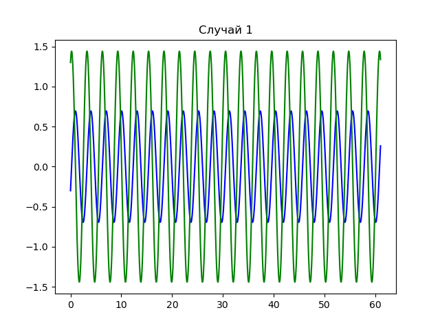
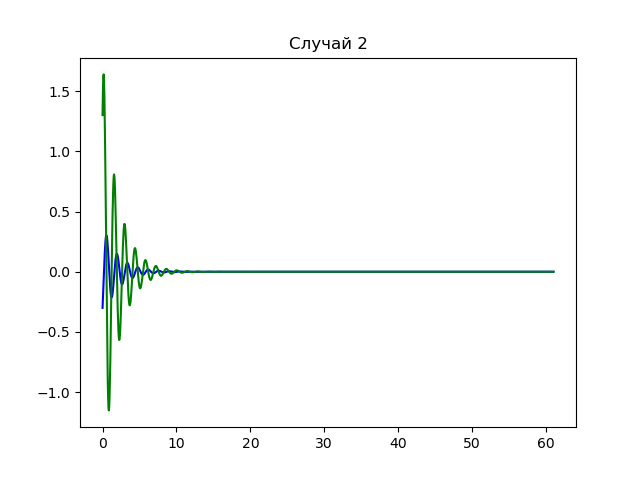
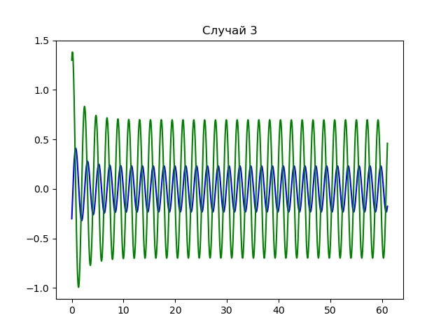
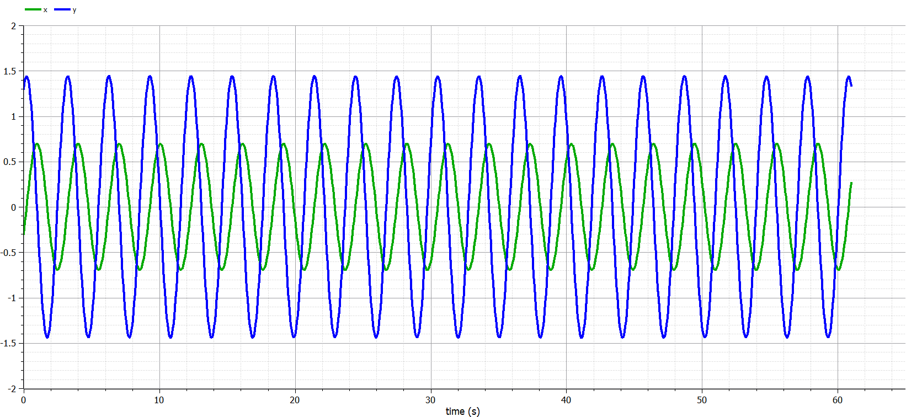
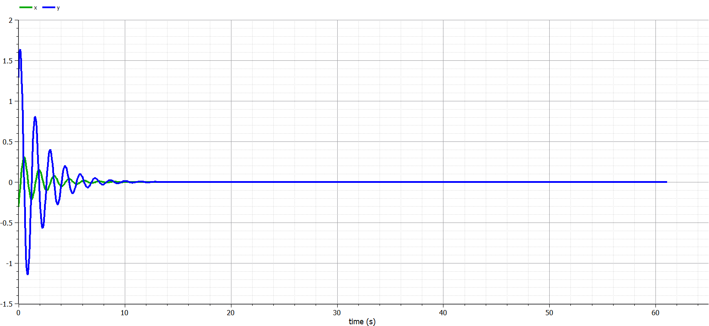
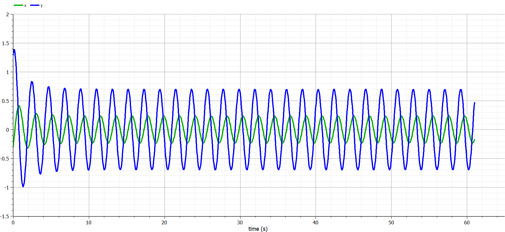

---
# Front matter
lang: ru-RU
title: "Отчет по лабораторной работе №4"
subtitle: "Модель гармонических колебаний - вариант 30"
author: "Евдокимов Максим Михайлович. НФИбд-01-20."

# Formatting
toc-title: "Содержание"
toc: true # Table of contents
toc_depth: 2
lof: true # List of figures
fontsize: 12pt
linestretch: 1.4
papersize: a4paper
documentclass: scrreprt
polyglossia-lang: russian
polyglossia-otherlangs: english
mainfont: PT Serif
romanfont: PT Serif
sansfont: PT Sans
monofont: PT Mono
mainfontoptions: Ligatures=TeX
romanfontoptions: Ligatures=TeX
sansfontoptions: Ligatures=TeX,Scale=MatchLowercase
monofontoptions: Scale=MatchLowercase
indent: true
pdf-engine: lualatex
header-includes:
  - \linepenalty=10 # the penalty added to the badness of each line within a paragraph (no associated penalty node) Increasing the υalue makes tex try to haυe fewer lines in the paragraph.
  - \interlinepenalty=0 # υalue of the penalty (node) added after each line of a paragraph.
  - \hyphenpenalty=50 # the penalty for line breaking at an automatically inserted hyphen
  - \exhyphenpenalty=50 # the penalty for line breaking at an explicit hyphen
  - \binoppenalty=700 # the penalty for breaking a line at a binary operator
  - \relpenalty=500 # the penalty for breaking a line at a relation
  - \clubpenalty=150 # extra penalty for breaking after first line of a paragraph
  - \widowpenalty=150 # extra penalty for breaking before last line of a paragraph
  - \displaywidowpenalty=50 # extra penalty for breaking before last line before a display math
  - \brokenpenalty=100 # extra penalty for page breaking after a hyphenated line
  - \predisplaypenalty=10000 # penalty for breaking before a display
  - \postdisplaypenalty=0 # penalty for breaking after a display
  - \floatingpenalty = 20000 # penalty for splitting an insertion (can only be split footnote in standard LaTeX)
  - \raggedbottom # or \flushbottom
  - \usepackage{float} # keep figures where there are in the text
  - \floatplacement{figure}{H} # keep figures where there are in the text
---

# Цель работы

Изучить уравнение гармонического осцилятора без затухания. Записать данное уравнение и построить 3 фазовый портрет (графика) гармонических и свободных колебаний.

# Задание

1. Построить решение уравнения гармонического осциллятора без затухания
2. Записать уравнение свободных колебаний гармонического осциллятора с затуханием, построить его решение. Построить фазовый портрет гармонических колебаний с затуханием.
3. Записать уравнение колебаний гармонического осциллятора, если на систему действует внешняя сила, построить его решение. Построить фазовый портрет колебаний с действием внешней силы.

## Теоретические сведения 1

Движение грузика на пружинке, маятника, заряда в электрическом контуре, а также эволюция во времени многих систем в разных науках при определенных предположениях можно описать одним дифференциальным уравнением.
Это уравнение в теории колебаний выступает в качестве основной модели. Эта модель называется линейным гармоническим осциллятором.
Уравнение свободных колебаний гармонического осциллятора имеет вид:

$$\ddot{x}+2\gamma\dot{x}+\omega_0^2=0$$

где:

* $x$ - переменная, описывающая состояние системы (смещение грузика, заряд конденсатора и т.д.),
* $\gamma$ - параметр, характеризующий потери энергии (трение в механической системе, сопротивление в контуре),
* $\omega$ - собственная частота колебаний.
Это уравнение есть линейное однородное дифференциальное  уравнение второго порядка и оно является примером линейной динамической системы.
(lab_example)

## Теоретические сведения 2

При отсутствии потерь в системе ( $\gamma=0$ ) получаем уравнение консервативного осциллятора энергия колебания которого сохраняется во времени. (source_of_the_theory)
$$\ddot{x}+\omega^2x=0$$

## Теоретические сведения 3

Для однозначной разрешимости уравнения второго порядка необходимо задать два начальных условия вида

$$
 \begin{cases}
 x(t_0)=x_0
 \\
 \dot{x}(t_0)=y_0
 \end{cases}
$$

Уравнение второго порядка можно представить в виде системы двух уравнений первого порядка:
$$
 \begin{cases}
 x=y
 \\
 y=-\omega^2x
 \end{cases}
$$

## Теоретические сведения 4

Тогда начальные условия для системы примут вид:
$$
 \begin{cases}
 x(t_0)=x_0
 \\
 y(t_0)=y_0
 \end{cases}
$$

## Теоретические сведения 5

Независимые переменные $x, y$ определяют пространство, в котором «движется» решение. Это фазовое пространство системы, поскольку оно двумерно будем называть его фазовой плоскостью.
Значение фазовых координат $x, y$ в любой момент времени полностью определяет состояние системы. Решению уравнения движения как функции времени отвечает гладкая кривая в фазовой плоскости. Она называется фазовой траекторией. Если множество различных решений (соответствующих различным
начальным условиям) изобразить на одной фазовой плоскости, возникает общая картина поведения системы. Такую картину, образованную набором фазовых траекторий, называют фазовым портретом.

## Условие задачи и пункты

(lab_task) Вариант № 30

Постройте фазовый портрет гармонического осциллятора и решение уравнения гармонического осциллятора для следующих случаев

1. Колебания гармонического осциллятора без затуханий и без действий внешней силы

$$\ddot{x}+4.3x=0$$

2. Колебания гармонического осциллятора c затуханием и без действий внешней силы

$$\ddot{x}+\dot{x}+20x=0$$

3. Колебания гармонического осциллятора c затуханием и под действием внешней силы

$$\ddot{x}+\dot{x}+8.8x=0.7\sin{3t}$$

На интервале $t \in [ 0;61 ]$ (шаг 0.05) с начальными условиями
$x_0=-0.3, y_0=1.3$

# Код программы на julia

```
using PyPlot
using DifferentialEquations

function f1(du, u, p, t)
    du[1] = u[2]
    du[2] = -w*u[1]
end

function f2(du, u, p, t)
    du[1] = u[2]
    du[2] = -2*g*u[2]-w*u[1]
end

function f3(du, u, p, t)
    du[1] = u[2]
    du[2] = -2*g*u[2]-w*u[1]+0.7*sin(3*t)
end

function draw(p)
    ax = PyPlot.axes()
    ax.set_title(p)
    ax.plot(x, y, linestyle="-", color="red")
    show()
    close()
    ax = PyPlot.axes()
    ax.set_title(p)
    ax.plot(time, x, linestyle="-", color="blue")
    ax.plot(time, y, linestyle="-", color="green")
    show()
    close()
end

range = (0, 61)
X = -0.3
Y = 1.3
w = 4.3
ode = ODEProblem(f1, [X,Y], range)
sol = solve(ode, dtmax=0.05)
x = [u[1] for u in sol.u]
y = [u[2] for u in sol.u]
time = [t for t in sol.t]
draw("Случай 1")

w = 20
g = 0.5
ode = ODEProblem(f2, [X,Y], range)
sol = solve(ode, dtmax=0.05)
x = [u[1] for u in sol.u]
y = [u[2] for u in sol.u]
time = [t for t in sol.t]
draw("Случай 2")

w = 8.8
g = 0.5
ode = ODEProblem(f3, [X,Y], range)
sol = solve(ode, dtmax=0.05)
x = [u[1] for u in sol.u]
y = [u[2] for u in sol.u]
time = [t for t in sol.t]
draw("Случай 3")
```

## Результат для случая 1

{#fig:001 width=70% height=70%}

.png){#fig:002 width=70% height=70%}

## Результат для случая 2

{#fig:003 width=70% height=70%}

.png){#fig:004 width=70% height=70%}

## Результат для случая 3

{#fig:005 width=70% height=70%}

.png){#fig:006 width=70% height=70%}

# Коды программы на Open Modelica

## случай 1: Колебания гармонического осциллятора без затуханий и без действий внешней силы

```
model model_1

  parameter Real w(start=4.3);
  Real x(start = -0.3);
  Real y(start = 1.3);
  
equation

  der(x)=y;
  der(y)=-sqrt(w)*x;
  
  annotation(experiment(StartTime = 0, StopTime = 61, Tolerance = 1e-6, Interval = 0.05));

end model_1;
```

* Результаты

{#fig:007 width=70% height=70%}

.png){#fig:008 width=70% height=70%}

## случай 2: Колебания гармонического осциллятора c затуханием и без действий внешней силы

```
model model_2

  parameter Real w(start=20);
  parameter Real g(start=0.5);
  Real x(start = -0.3);
  Real y(start = 1.3);
  
equation

  der(x)=y;
  der(y)=-2*g*y-sqrt(w)*x;
  
  annotation(experiment(StartTime = 0, StopTime = 61, Tolerance = 1e-6, Interval = 0.05));

end model_2;
```

* Результаты

{#fig:009 width=70% height=70%}

.png){#fig:010 width=70% height=70%}

## случай 1: Колебания гармонического осциллятора c затуханием и под действием внешней силы

```
model model_3

  parameter Real w(start=8.8);
  parameter Real g(start=0.5);
  Real x(start = -0.3);
  Real y(start = 1.3);
  
equation

  der(x)=y;
  der(y)=-2*g*y-sqrt(w)*x+0.7*sin(3*time);
  
  annotation(experiment(StartTime = 0, StopTime = 61, Tolerance = 1e-6, Interval = 0.05));  

end model_3;
```

* Результаты

{#fig:011 width=70% height=70%}

.png){#fig:012 width=70% height=70%}

# Выводы

В ходе выполнения лабораторной работы мы построили решения уравнений гармонического осциллятора, а также фазовые портреты для трех случаев:

1. Колебания гармонического осциллятора без затуханий и без действий внешней силы
2. Колебания гармонического осциллятора c затуханием и без действий внешней силы
3. Колебания гармонического осциллятора c затуханием и под действием внешней силы
