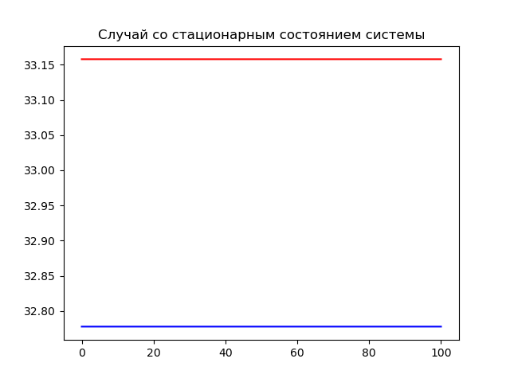

---
## Front matter
lang: ru-RU
title: Модель хищник-жертва Лотки-Вольтерры. Вариант 30
author: |
	 Евдокимов Максим Михайлович НФИбд-01-20\inst{1}
institute: |
	\inst{1}Российский Университет Дружбы Народов
date: 3 марта, 2023, Москва, Россия

## Formatting
mainfont: PT Serif
romanfont: PT Serif
sansfont: PT Sans
monofont: PT Mono
toc: false
slide_level: 2
theme: metropolis
header-includes: 
 - \metroset{progressbar=frametitle,sectionpage=progressbar,numbering=fraction}
 - '\makeatletter'
 - '\beamer@ignorenonframefalse'
 - '\makeatother'
aspectratio: 43
section-titles: true
---

# Цели и задачи работы

## Цель лабораторной работы

Изучить простейшую модель Лотки-Вольтерры хищник-жертва, основанную на нескольких предлоположениях.
Построить модель с помощью дифференциальных уравнений. Сделать выводы по заданию

## Задание к лабораторной работе

1. Построить график зависимости $x$ от $y$ и графики функций $x(t)$, $y(t)$.
2. Найти стационарное состояние системы.

# Процесс выполнения лабораторной работы

## Теоретический материал

Пусть для этой системы выполняется следующее:

1. Численность популяции жертв и хищников зависят только от времени (модель не учитывает пространственное распределение популяции на занимаемой территории)
2. В отсутствии взаимодействия численность видов изменяется по модели Мальтуса, при этом число жертв увеличивается, а число хищников падает
3. Естественная смертность жертвы и естественная рождаемость хищника считаются несущественными
4. Эффект насыщения численности обеих популяций не учитывается
5. Скорость роста численности жертв уменьшается пропорционально численности хищников

# Задание

## Условие задачи

$$
 \begin{cases}
 \frac{dx}{dt} = -ax(t) + by(t)x(t)
 \\
 \frac{dy}{dt} = cy(t) - dy(t)x(t)
 \end{cases}
$$

Стационарное состояние системы определяется следующим образом:
$$
 x_0=\frac{c}{d}, y_0=\frac{a}{b}
$$

## Мой вариант

$$
 \begin{cases}
 \frac{dx}{dt} = -0.63x(t) + 0.019y(t)x(t)
 \\
 \frac{dy}{dt} = 0.59y(t) - 0.018y(t)x(t)
 \end{cases}
$$

Постройте график зависимости численности хищников от численности жертв, а также графики изменения численности хищников и численности жертв при следующих начальных условиях: $x_0=7, y_0=12$

# Результаты работы

## Графики при изночальном состоянии системы

 | 
|--------------------------|--------------------------|
.png){#fig:001 width=50%} | {#fig:002 width=50%}

## Графики при стоционарном состояния системы

Стационарное состояние $x_0=\frac{c}{d}=32.7778, y_0=\frac{a}{b}=33.1579$

 | 
|--------------------------|--------------------------|
.png){#fig:003 width=50%} | {#fig:004 width=50%}

# Выводы по проделанной работе

## Вывод

В ходе выполнения лабораторной работы была изучена модель хищник-жертва и построены графики зависимости количества хищников и жертв в разных отношениях и в разные периоды времени.
