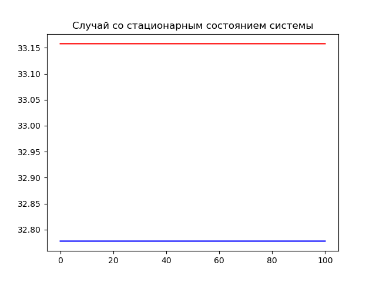

---
# Front matter
lang: ru-RU
title: "Отчет по ходу работы лабораторной №5"
subtitle: "Модель хищник-жертва Лотки-Вольтерры. Вариант 30"
author: "Евдокимов Максим Михайлович НФИбд-01-20"
bibliography: "cite.bib"

# Formatting
toc-title: "Содержание"
toc: true # Table of contents
toc_depth: 2
lof: true # List of figures
fontsize: 12pt
linestretch: 1.5
papersize: a4paper
documentclass: scrreprt
polyglossia-lang: russian
polyglossia-otherlangs: english
mainfont: PT Serif
romanfont: PT Serif
sansfont: PT Sans
monofont: PT Mono
mainfontoptions: Ligatures=TeX
romanfontoptions: Ligatures=TeX
sansfontoptions: Ligatures=TeX,Scale=MatchLowercase
monofontoptions: Scale=MatchLowercase
indent: true
pdf-engine: lualatex
header-includes:
  - \linepenalty=10 # the penalty added to the badness of each line within a paragraph (no associated penalty node) Increasing the υalue makes tex try to haυe fewer lines in the paragraph.
  - \interlinepenalty=0 # υalue of the penalty (node) added after each line of a paragraph.
  - \hyphenpenalty=50 # the penalty for line breaking at an automatically inserted hyphen
  - \exhyphenpenalty=50 # the penalty for line breaking at an explicit hyphen
  - \binoppenalty=700 # the penalty for breaking a line at a binary operator
  - \relpenalty=500 # the penalty for breaking a line at a relation
  - \clubpenalty=150 # extra penalty for breaking after first line of a paragraph
  - \widowpenalty=150 # extra penalty for breaking before last line of a paragraph
  - \displaywidowpenalty=50 # extra penalty for breaking before last line before a display math
  - \brokenpenalty=100 # extra penalty for page breaking after a hyphenated line
  - \predisplaypenalty=10000 # penalty for breaking before a display
  - \postdisplaypenalty=0 # penalty for breaking after a display
  - \floatingpenalty = 20000 # penalty for splitting an insertion (can only be split footnote in standard LaTeX)
  - \raggedbottom # or \flushbottom
  - \usepackage{float} # keep figures where there are in the text
  - \floatplacement{figure}{H} # keep figures where there are in the text
---

# Цель работы

Изучить простейшую модель Лотки-Вольтерры хищник-жертва, основанную на нескольких предлоположениях.
Построить модель с помощью дифференциальных уравнений. Сделать выводы по заданию

# Задание

1. Построить график зависимости $x$ от $y$ и графики функций $x(t)$, $y(t)$
2. Найти стационарное состояние системы

# Выполнение лабораторной работы

## Теоретические сведения

В данной лабораторной работе рассматривается математическая модель системы «Хищник-жертва». [source_of_the_theory]

* Рассмотрим базисные компоненты системы: $X$ хищников и $Y$ жертв.  
* Пусть для этой системы выполняются следующие предположения: (Модель Лотки-Вольтерра).

1. Численность популяции жертв и хищников зависят только от времени (модель не учитывает пространственное распределение популяции на занимаемой территории)
2. В отсутствии взаимодействия численность видов изменяется по модели Мальтуса, при этом число жертв увеличивается, а число хищников падает
3. Естественная смертность жертвы и естественная рождаемость хищника считаются несущественными
4. Эффект насыщения численности обеих популяций не учитывается
5. Скорость роста численности жертв уменьшается пропорционально численности хищников:

$$
 \begin{cases}
 \frac{dx}{dt} = -ax(t) + by(t)x(t)
 \\
 \frac{dy}{dt} = cy(t) - dy(t)x(t)
 \end{cases}
$$

## Теоретические сведения

Параметр $a$ определяет коэффициент смертности хищников, $b$ – коэффициент естественного прироста хищников, $c$ – коэффициент прироста жертв и $d$ – коэффициент смертности жертв.

В зависимости от этих параметрах система и будет изменяться. Однако следует выделить одно важное состояние системы, при котором не происходит никаких изменений как со стороны хищников, так и со стороны жертв. Это, так называемое, стационарное состояние системы. При нем, как уже было отмечено, изменение численности популяции равно нулю.

Следовательно, при отсутствии изменений в системе $\frac{dx}{dt} = 0, \frac{dy}{dt} = 0$

Пусть по условию есть хотя бы один хищник и хотя бы одна жертва: $x>0, y>0$
Тогда стационарное состояние системы определяется следующим образом:
$$
 x_0=\frac{c}{d}, y_0=\frac{a}{b}
$$

# Задача

## Условие задачи

В лесу проживают х число волков, питающихся зайцами, число которых в
этом же лесу у. Пока число зайцев достаточно велико, для прокормки всех волков, численность волков растет до тех пор, пока не наступит момент, что корма перестанет хватать на всех. Тогда волки начнут умирать, и их численность будет уменьшаться.
В этом случае в какой-то момент времени численность зайцев снова
начнет увеличиваться, что повлечет за собой новый рост популяции волков. Такой цикл будет повторяться, пока обе популяции будут существовать. Помимо этого,на численность стаи влияют болезни и старение. [lab_example]

Данная модель описывается следующим уравнением:
$$
 \begin{cases}
 \frac{dx}{dt} = -ax(t) + by(t)x(t)
 \\
 \frac{dy}{dt} = cy(t) - dy(t)x(t)
 \end{cases}
$$

## Мой вариант

$$
 \begin{cases}
 \frac{dx}{dt} = -0.63x(t) + 0.019y(t)x(t)
 \\
 \frac{dy}{dt} = 0.59y(t) - 0.018y(t)x(t)
 \end{cases}
$$

Постройте график зависимости численности хищников от численности жертв, а также графики изменения численности хищников и численности жертв при следующих начальных условиях: $x_0=7, y_0=12$
Найдите стационарное состояние системы. [lab_task]

## Приведение значение к стационарному

Стационарное состояние $x_0=\frac{c}{d}=32.7778, y_0=\frac{a}{b}=33.1579$

# Код программы на julia

[Predator-prey_model]

```
using PyPlot
using DifferentialEquations

function f(du, u, p, t)
    du[1] = -a*u[1] + b*u[1]*u[2]
    du[2] = c*u[2] - d*u[1]*u[2]
end

function draw(p)
    ax = PyPlot.axes()
    ax.set_title(p)
    ax.plot(x, y, color="green")
    show()
    close()
    ax = PyPlot.axes()
    ax.set_title(p)
    ax.plot(time, x, color="blue")
    ax.plot(time, y, color="red")
    show()
    close()
end

range = (0, 100)
a = 0.63 # коэф. смертности хищников
b = 0.019 # коэф. прироста жертв
c = 0.59 # коэф. числа хищников
d = 0.018 # коэф.смертности жертв
X = 7
Y = 12
ode = ODEProblem(f, [X,Y], range)
sol = solve(ode, dtmax=0.02)
x = [u[1] for u in sol.u]
y = [u[2] for u in sol.u]
time = [t for t in sol.t]
draw("Случай с указанным начальным состоянием системы")

X = c/d
Y = a/b
ode = ODEProblem(f, [X,Y], range)
sol = solve(ode, dtmax=0.02)
x = [u[1] for u in sol.u]
y = [u[2] for u in sol.u]
time = [t for t in sol.t]
draw("Случай со стационарным состоянием системы")
```

Результаты работы:

.png){#fig:001 width=70% height=70%}

{#fig:002 width=70% height=70%}

.png){#fig:003 width=70% height=70%}

{#fig:004 width=70% height=70%}

# Код программы OpenMoelica

## Случай с указанным начальным состоянием системы

```
model model_1

parameter Real a = 0.63;
parameter Real b = 0.019;
parameter Real c = 0.59;
parameter Real d = 0.018;

parameter Real x0=7;
parameter Real y0=12;

Real x(start =x0);
Real y(start =y0);

equation
  der(x) = -a*x + b*x*y;
  der(y) = c*y - d*x*y;

  annotation(experiment(StartTime = 0, StopTime = 100, Tolerance = 1e-6, Interval = 0.02));

end model_1;
```

Результаты работы:

.png){#fig:005 width=70% height=70%}

{#fig:006 width=70% height=70%}

## Случай со стационарным состоянием системы

```
model model_2

parameter Real a = 0.63;
parameter Real b = 0.019;
parameter Real c = 0.59;
parameter Real d = 0.018;

parameter Real x0=c/d;
parameter Real y0=a/b;

Real x(start =x0);
Real y(start =y0);

equation
  der(x) = -a*x + b*x*y;
  der(y) = c*y - d*x*y;

  annotation(experiment(StartTime = 0, StopTime = 100, Tolerance = 1e-6, Interval = 0.02));

end model_2;
```

Результаты работы:

.png){#fig:007 width=70% height=70%}

{#fig:008 width=70% height=70%}

# Выводы

В ходе выполнения лабораторной работы была изучена модель хищник-жертва и построены графики зависимости количества хищников и жертв в разных отношениях и в разные периоды времени.
