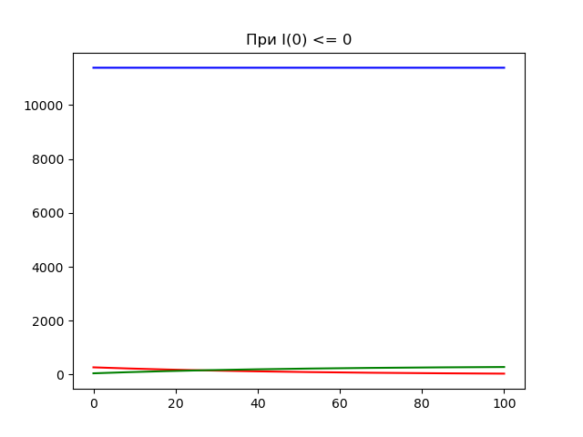
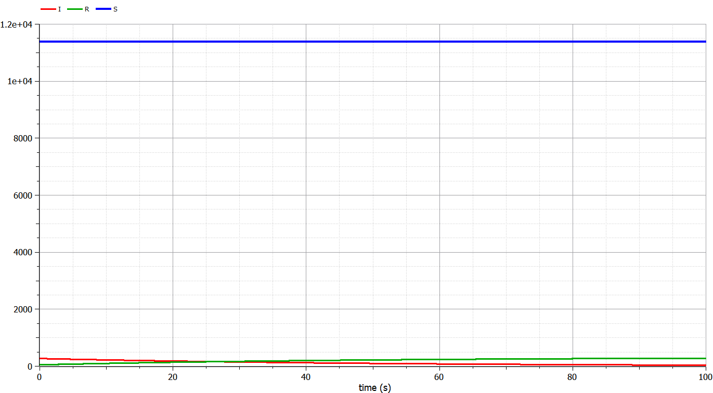
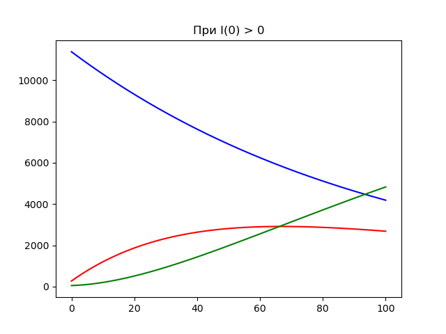
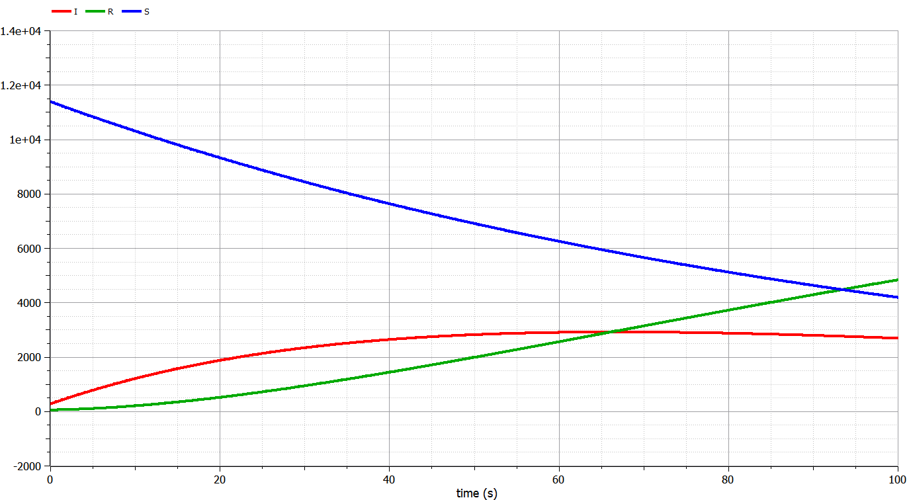

---
## Front matter
lang: ru-RU
title: Презентация по ходу работы над моделью эпидемии SIR
author: Евдокимов Максим михайлович\inst{1}

institute: \inst{1}Российский Университет Дружбы Народов

date: 6 марта, 2023, Москва, Россия

## Formatting pdf
toc: false
toc-title: Содержание
slide_level: 2
aspectratio: 169
section-titles: true
theme: metropolis
header-includes:
 - \metroset{progressbar=frametitle,sectionpage=progressbar,numbering=fraction}
 - '\makeatletter'
 - '\beamer@ignorenonframefalse'
 - '\makeatother'
---

# Цель лабораторной работы

## Цель лабораторной работы

Изучить простейшую модель эпидемии $SIR$. Используя условия из варианты, задать в уравнение начальные условия и коэффициенты.
После построить графики изменения численностей трех групп в двух случаях.

# Теория

## Задачи лабораторной работы

1. Изучить модель эпидемии
2. Построить графики изменения числа особей в каждой из трех групп. Рассмотреть, как будет протекать эпидемия в случае: $I(0)\leq I^*$, $I(0)>I^*$

## Теоретический материал 1

Предположим, что некая популяция, состоящая из $N$ особей, подразделяется на три группы. Первая группа - это восприимчивые к болезни, но пока здоровые особи - $S(t)$. Вторая группа – это число инфицированных особей, которые также являются распространителями инфекции - $I(t)$. А третья группа $R(t)$ – это здоровые особи с иммунитетом к болезни.
До того, как число заболевших не превышает критического значения $I^*$, считаем, что все больные изолированы и не заражают здоровых. Когда $I(t)> I^*$, тогда инфицирование способны заражать восприимчивых к болезни особей.

## Теоритический материал 2

Дальше чуть сложнее, чтобы понимать сколько людей заразиться на каждом шаге, надо понимать наличие двух вероятностей: вероятность контакта между двумя индивидами и вероятность заразить при контакте инфицированного с восприимчивым (β). Часто в модели для воплощения первой вероятности используют просто 1/N (N – объём популяции), подразумевая, что в каждый момент времени каждый индивид контактирует с одним случайным индивидом в популяции. А вторая вероятность (β), обеспечивает собственно биологический показатель заразности конкретного патогена (со всеми влияющим факторами: температура, наличие маски и т.п.).

## Теоритический материал 3

Cкорость изменения числа $S(t)$ меняется по следующему закону:

$$
\frac{dS}{dt}=
 \begin{cases}
 -\alpha S &\text{,если $I(t) > I^*$}
 \\
 0 &\text{,если $I(t) \leq I^*$}
 \end{cases}
$$

## Теоретический материал 4

Cкорость изменения числа инфекционных особей:

$$
\frac{dI}{dt}=
 \begin{cases}
 \alpha S -\beta I &\text{,если $I(t) > I^*$}
 \\
 -\beta I &\text{,если $I(t) \leq I^*$}
 \end{cases}
$$

## Теоретический материал 5

Cкорость изменения выздоравливающих особей:

$$\frac{dR}{dt} = \beta I$$

Постоянные пропорциональности $\alpha, \beta$ - это коэффициенты заболеваемости и выздоровления соответственно.
Для анализа картины протекания эпидемии необходимо рассмотреть два случая:  $I(0) \leq I^*$ и  $I(0)>I^*$

# Задача

## Условие задачи

На одном острове вспыхнула эпидемия. Известно, что из всех проживающих на острове $(N=11700)$ в момент начала эпидемии $(t=0)$ число заболевших людей (являющихся распространителями инфекции) $I(0)=270$, А число здоровых людей с иммунитетом к болезни $R(0)=49$. Таким образом, число людей восприимчивых к болезни, но пока здоровых, в начальный момент времени $S(0)=N-I(0)-R(0)$.
Постройте графики изменения числа особей в каждой из трех групп.

Рассмотрите, как будет протекать эпидемия в случае:

1. $I(0)\leq I^*$
2. $I(0)>I^*$

## Графики изменения численности в первом случае на Julia

{ #fig:001 width=70% height=70% }

## Графики изменения численности в первом случае на OpenModelica

{ #fig:002 width=70% height=70% }

## Графики изменения численности во втором случае  на Julia

{ #fig:003 width=70% height=70% }

## Графики изменения численности во втором случае на OpenModelica

{ #fig:004 width=70% height=70% }

# Выводы по проделанной работе

## Вывод

В ходе выполнения лабораторной работы была изучена простейшая модель эпидемии и построены графики на основе условий задачи и начальных данных, которые были описаны в варианте лабораторной работы.
