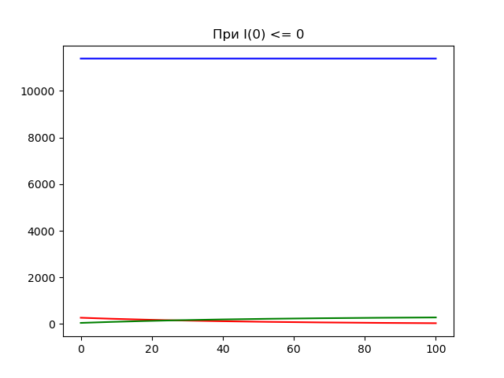
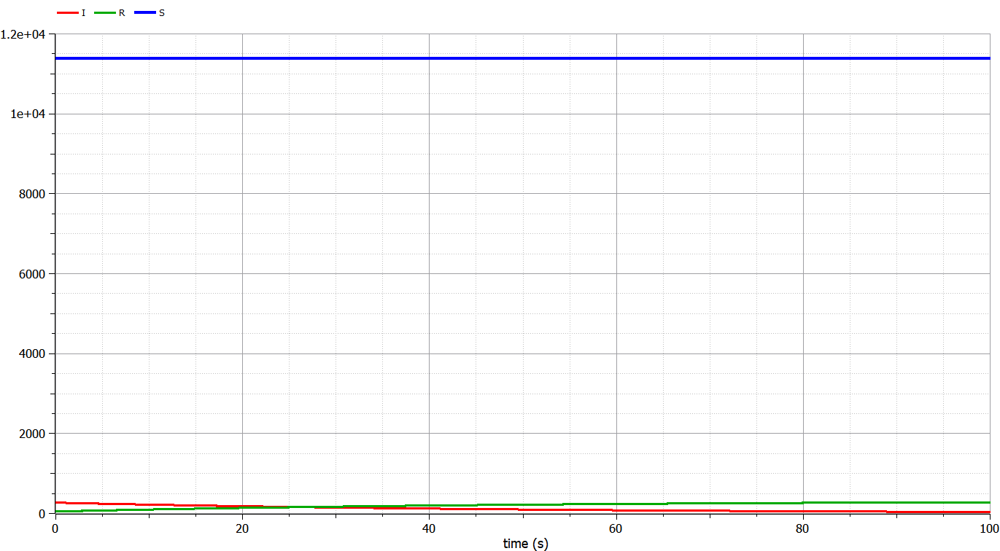
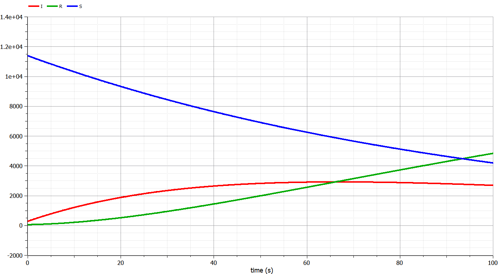

---
# Front matter
lang: ru-RU
title: "Отчет по ходу лабораторной работы №6"
subtitle: "Модель эпидемии - вариант 30"
author: "Евдокимов Максим Михайлович"

## Generic otions
lang: ru-RU
toc-title: "Содержание"

## Bibliography
bibliography: bib/cite.bib
csl: pandoc/csl/gost-r-7-0-5-2008-numeric.csl

## Pdf output format
toc: true # Table of contents
toc-depth: 2
lof: true # List of figures
fontsize: 12pt
linestretch: 1.5
papersize: a4
documentclass: scrreprt
## I18n polyglossia
polyglossia-lang:
  name: russian
  options:
	- spelling=modern
	- babelshorthands=true
polyglossia-otherlangs:
  name: english
## I18n babel
babel-lang: russian
babel-otherlangs: english
## Fonts
mainfont: PT Serif
romanfont: PT Serif
sansfont: PT Sans
monofont: PT Mono
mainfontoptions: Ligatures=TeX
romanfontoptions: Ligatures=TeX
sansfontoptions: Ligatures=TeX,Scale=MatchLowercase
monofontoptions: Scale=MatchLowercase,Scale=0.9
## Biblatex
biblatex: true
biblio-style: "gost-numeric"
biblatexoptions:
  - parentracker=true
  - backend=biber
  - hyperref=auto
  - language=auto
  - autolang=other*
  - citestyle=gost-numeric
## Pandoc-crossref LaTeX customization
figureTitle: "Рис."
listingTitle: "Листинг"
lofTitle: "Список иллюстраций"
lolTitle: "Листинги"
## Misc options
indent: true
header-includes:
  - \usepackage{indentfirst}
  - \usepackage{float} # keep figures where there are in the text
  - \floatplacement{figure}{H} # keep figures where there are in the text
---

# Цель работы

## Цель лабораторной работы

Изучить простейшую модель эпидемии $SIR$. Используя условия из варианты, задать в уравнение начальные условия и коэффициенты.
После построить графики изменения численностей трех групп в двух случаях. @lab_example

# Задачи

## Задачи лабораторной работы

1. Изучить модель эпидемии
2. Построить графики изменения числа особей в каждой из трех групп.
3. Рассмотреть, как будет протекать эпидемия в случае: $I(0)\leq I^*$, $I(0)>I^*$

# Ход выполнения лабораторной работы

## Теоретические сведения

Рассмотрим простейшую модель эпидемии. Предположим, что некая популяция, состоящая из $N$ особей, (считаем, что популяция изолирована) подразделяется на три группы. Первая группа - это восприимчивые к болезни, но пока здоровые особи, обозначим их через $S(t)$. Вторая группа – это число инфицированных особей, которые также при этом являются распространителями инфекции, обозначим их $I(t)$. А третья группа, обозначающаяся через $R(t)$ – это здоровые особи с иммунитетом к болезни. @Predator-prey_model
До того, как число заболевших не превышает критического значения $I^*$, считаем, что все больные изолированы и не заражают здоровых. Когда $I(t)> I^*$, тогда инфицирование способны заражать восприимчивых к болезни особей.

Таким образом, скорость изменения числа $S(t)$ меняется по следующему закону:

$$
\frac{dS}{dt}=
 \begin{cases}
 -\alpha S &\text{,если $I(t) > I^*$}
 \\
 0 &\text{,если $I(t) \leq I^*$}
 \end{cases}
$$

## Теоретические сведения

Поскольку каждая восприимчивая к болезни особь, которая, в конце концов, заболевает, сама становится инфекционной, то скорость изменения числа инфекционных особей представляет разность за единицу времени между заразившимися и теми, кто уже болеет и лечится. Т.е.:

$$
\frac{dI}{dt}=
 \begin{cases}
 \alpha S -\beta I &\text{,если $I(t) > I^*$}
 \\
 -\beta I &\text{,если $I(t) \leq I^*$}
 \end{cases}
$$

## Теоретические сведения

@source_of_the_theory Рассмотрим скорость изменения выздоравливающих особей, которые при этом приобретают иммунитет к болезни:

$$\frac{dR}{dt} = \beta I$$

Постоянные пропорциональности $\alpha, \beta$ - это коэффициенты заболеваемости и выздоровления соответственно. Для того, чтобы решения соответствующих уравнений определялось однозначно, необходимо задать начальные условия. Считаем, что на начало эпидемии в момент времени $t=0$ нет особей с иммунитетом к болезни $R(0)=0$, а число инфицированных и восприимчивых к болезни особей $I(0)$ и $S(0)$ соответственно. Для анализа картины протекания эпидемии необходимо рассмотреть два случая:  $I(0) \leq I^*$ и  $I(0)>I^*$

# Задача

## Условие задачи

@lab_task На одном острове вспыхнула эпидемия. Известно, что из всех проживающих на острове $(N=11700)$ в момент начала эпидемии $(t=0)$ число заболевших людей (являющихся распространителями инфекции) $I(0)=270$, А число здоровых людей с иммунитетом к болезни $R(0)=49$. Таким образом, число людей восприимчивых к болезни, но пока здоровых, в начальный момент времени $S(0)=N-I(0)-R(0)$.
Постройте графики изменения числа особей в каждой из трех групп.
Рассмотрите, как будет протекать эпидемия в случае:

1. $I(0)\leq I^*$
2. $I(0)>I^*$

# Код программы

## Код на Julia

```
using PyPlot
using DifferentialEquations

function f1(du, u, p, t)
    du[1] = 0
    du[2] = -b*u[2]
    du[3] = b*u[2]
end

function f2(du, u, p, t)
    du[1] = -a*u[1]
    du[2] = a*u[1]-b*u[2]
    du[3] = b*u[2]
end

function draw(p)
    ax = PyPlot.axes()
    ax.set_title(p)
    ax.plot(time, s, color="blue")
    ax.plot(time, i, color="red")
    ax.plot(time, r, color="green")
    show()
    close()
end

range = (0, 100)
a = 0.01 # коэф. заболевания
b = 0.02 # коэф. выздоровления
N = 11700 # всего людей
I0 = 270 # изначально инфицированные
R0 = 49 # изначально с имунитетом
S0 = N - I0 - R0 # изначально восприимчивых
ode = ODEProblem(f1, [S0,I0,R0], range)
sol = solve(ode, dtmax=0.02)
s = [u[1] for u in sol.u]
i = [u[2] for u in sol.u]
r = [u[3] for u in sol.u]
time = [t for t in sol.t]
draw("При I(0) <= 0")

ode = ODEProblem(f2, [S0,I0,R0], range)
sol = solve(ode, dtmax=0.02)
s = [u[1] for u in sol.u]
i = [u[2] for u in sol.u]
r = [u[3] for u in sol.u]
time = [t for t in sol.t]
draw("При I(0) > 0")
```

## Результаты работы

{ #fig:001 width=70% height=70% }

{ #fig:002 width=70% height=70% }

## Код на OpenModelica

```
model model_1

parameter Real a = 0.01;
parameter Real b = 0.02;
parameter Real N = 11700;
parameter Real I0 = 270;
parameter Real R0 = 49;
parameter Real S0 = N - I0 - R0;
Real S(start=S0);
Real I(start=I0);
Real R(start=R0);

equation
// случай, когда I(0)<=I*
  der(S) = 0;
  der(I) = -b*I;
  der(R) = b*I;

  annotation(experiment(StartTime = 0, StopTime = 100, Tolerance = 1e-6, Interval = 0.02));

end model_1;
```

```
model model_2

parameter Real a = 0.01;
parameter Real b = 0.02;
parameter Real N = 11700;
parameter Real I0 = 270;
parameter Real R0 = 49;
parameter Real S0 = N - I0 - R0;
Real S(start=S0);
Real I(start=I0);
Real R(start=R0);

equation  
  // случай, когда I(0)> I*
  der(S) = -a*S;
  der(I) = a*S - b*I;
  der(R) = b*I;

  annotation(experiment(StartTime = 0, StopTime = 100, Tolerance = 1e-6, Interval = 0.02));

end model_2;
```

## Результаты работы

{ #fig:003 width=70% height=70% }

{ #fig:004 width=70% height=70% }

# Выводы

В ходе выполнения лабораторной работы была изучена простейшая модель эпидемии и построены графики на основе условий задачи и начальных данных, которые были описаны в варианте лабораторной работы.

# Список литературы {.unnumbered}

1. [Конструирование эпидемиологических моделей](https://habr.com/ru/post/551682/)
2. [Непрерывные математические моделитема: «Модель эпидемии»](https://studfile.net/preview/1512863/)
3. [МОДЕЛЬ ЭПИДЕМИИ SIR С УЧЕТОМ ПРОСТРАНСТВЕННОЙНЕОДНОРОДНОСТИ РАСПОЛОЖЕНИЯ ИНДИВИДОВ](http://ptsj.ru/articles/490/490.pdf)
