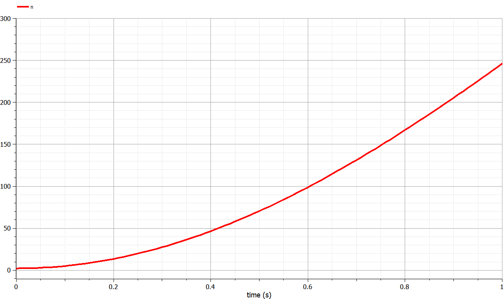
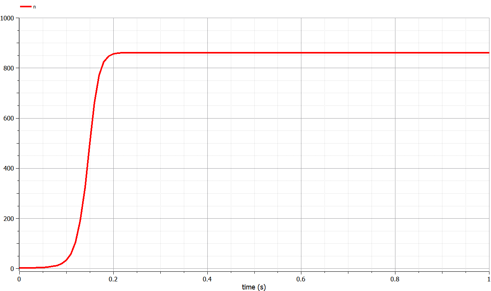
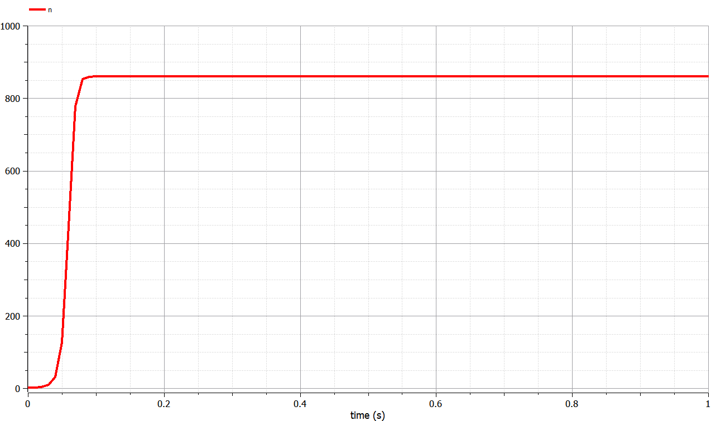

---
## Front matter
## Front matter
lang: ru-RU
title: Модель распространения рекламы. Вариант работы №30.
author: Евдокимов Максим Михайлович. Группа - НФИбд-01-20.\inst{1}

institute: \inst{1}Российский Университет Дружбы Народов

date: 9 марта, 2023, Москва, Россия

## i18n babel
babel-lang: russian
babel-otherlangs: english

## Formatting pdf
toc: false
toc-title: Содержание
slide_level: 2
aspectratio: 169
section-titles: true
theme: metropolis
header-includes:
 - \metroset{progressbar=frametitle,sectionpage=progressbar,numbering=fraction}
 - '\makeatletter'
 - '\beamer@ignorenonframefalse'
 - '\makeatother'
---

# Цели и задачи работы

## Цель лабораторной работы

Изучить модель эффективности распространения рекламы о салоне красоты. Задать эффективность в двух случаях.
Построить решение на основе начальных данных. Сделать на основании построений выводы.

## Задание к лабораторной работе

1. Изучить модель эфеективности распространения рекламы
2. Построить графики распространения рекламы в трех заданных случайх
3. Определить для случая 2 момент времени, в который скорость распространения рекламы будет максимальной
4. Сделать выводы из трех моделей

# Процесс выполнения лабораторной работы

## Теоретический материал 1

$\frac{dn}{dt}$ - скорость изменения со временем числа потребителей, узнавших о товаре и готовых его купить,
$t$ - время, прошедшее с начала рекламной кампании,
$N$ - общее число потенциальных платежеспособных покупателей,
$n(t)$ - число  уже информированных клиентов.

## Теоретический материал 2

Величина $n(t)$ пропорциональна числу покупателей, еще не знающих о нем, это описывается следующим образом
$\alpha _1(t)(N-n(t))$, где $\alpha_1>0$ -  характеризует интенсивность рекламной кампании.
Помимо этого, узнавшие о товаре потребители также распространяют полученную информацию среди потенциальных покупателей, не знающих о нем. Этот вклад в рекламу описывается величиной  $\alpha_2(t)n(t)(N-n(t))$. эта величина увеличивается с увеличением потребителей узнавших о товаре.

## Теоретический материал 3

Математическая модель распространения рекламы описывается уравнением:
$$\frac{dn}{dt} = (\alpha _1(t) + \alpha_2(t)n(t))(N-n(t))$$

При $\alpha _1(t) >> \alpha_2(t)$ получается модель типа модели Мальтуса.

В обратном случае $\alpha _1(t) << \alpha_2(t)$ получаем уравнение логистической кривой.

## Теоретический материал 5

В функциях выражающих $\alpha _1(t)$ и $\alpha_2(t)$ коэффициет (в примере обазначенные как $v$ и $g$) умноженные на $t$.

# Условие задачи

Постройте график распространения рекламы, математическая модель которой описывается следующим уравнением:

1. $\frac{dn}{dt} = (0.66 + 0.000061n(t))*(N-n(t))$
2. $\frac{dn}{dt} = (0.000056 + 0.66n(t))*(N-n(t))$
3. $\frac{dn}{dt} = (0.66 sin{t} + 0.66 sin{6t} n(t))*(N-n(t))$

При этом объем аудитории $N = 860$, в начальный момент о товаре знает 2 человек. Для случая 2 определите в какой момент времени скорость распространения рекламы будет иметь максимальное значение.

# Результаты работы

## График в первом случае Julia

{#fig:001 width=70% height=70%}

## График в первом случае OpenModelica

{#fig:002 width=70% height=70%}

## График во втором случае Julia

{#fig:003 width=70% height=70%}

## График во втором случае OpenModelica

{#fig:004 width=70% height=70%}

## График в третьем случае Julia

{#fig:005 width=70% height=70%}

## График в третьем случае OpenModelica

{#fig:006 width=70% height=70%}

# Выводы по проделанной работе

## Вывод

В ходе выполнения лабораторной работы была изучена модель эффективности рекламы и построены графики. Также эти графики были изучены и сделаны выводе о работе программ и эффективности распространения.
